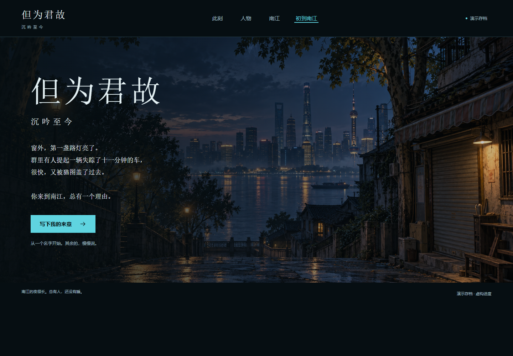

# 诺伊曼 · 前端制作

《但为君故 · 沉吟至今》前端 v0.2，设计方向为 **夜航档案 · 江雾留痕**。

本文件夹独立保存本次设计、前端源码、原创概念素材和离线预览，不替换项目现有的角色卡、变量结构或前端脚本。

## 先看这里

- [单文件离线前端](./但为君故-离线前端.html)：下载后用浏览器打开，图片、样式、脚本全部内嵌，无需服务器或网络。
- [前端源码入口](./frontend/index.html)：下载完整目录后打开，适合继续开发。
- [独立紧凑状态栏](./frontend/statusbar.html)：展示可展开的人物与线索摘要。
- [完整设计提案](./但为君故-前端设计提案.md)
- [使用说明与接入接口](./frontend/README.md)
- [验证记录](./frontend/verification.json)

GitHub 文件页展示 HTML 源码，不会直接运行这个前端。此提交不包含 GitHub Pages 发布。

## 内容

```text
诺伊曼/
├─ README.md
├─ 但为君故-前端设计提案.md
├─ 但为君故-离线前端.html
└─ frontend/
   ├─ index.html
   ├─ statusbar.html
   ├─ source/                 HTML 渲染逻辑、数据与样式
   ├─ assets/                 五张人物概念立绘、一张南江场景
   ├─ build.cjs               单文件打包脚本
   ├─ asset-prompts.json      图像生成提示词与来源说明
   ├─ verification.json      离线检查结果
   └─ preview-*.png           页面预览
```

已实现：五人人物切换、身份条件展示、好感零点刻度、状态摘要、开场问卷与草稿隔离、预览复制发言、四区公共索引、本地 JSON 导入和响应式布局。

首次打开为明确标注的演示存档，人物关系和记事是虚构示例；右上角可切换到原始初始状态。立绘由 AI 生成，为本次设计的原创概念资产，尚不代表原作者确认的正式人物图。未使用《鸣潮》的图片或代码。

**验收边界：30 项离线检查通过，真实 SillyTavern / Tavern Helper / MVU 接入与运行时验收尚未完成。** 开场发言目前采用复制后通过酒馆正常输入发送；前端不自动初始化或修改正式变量。

## 界面预览



