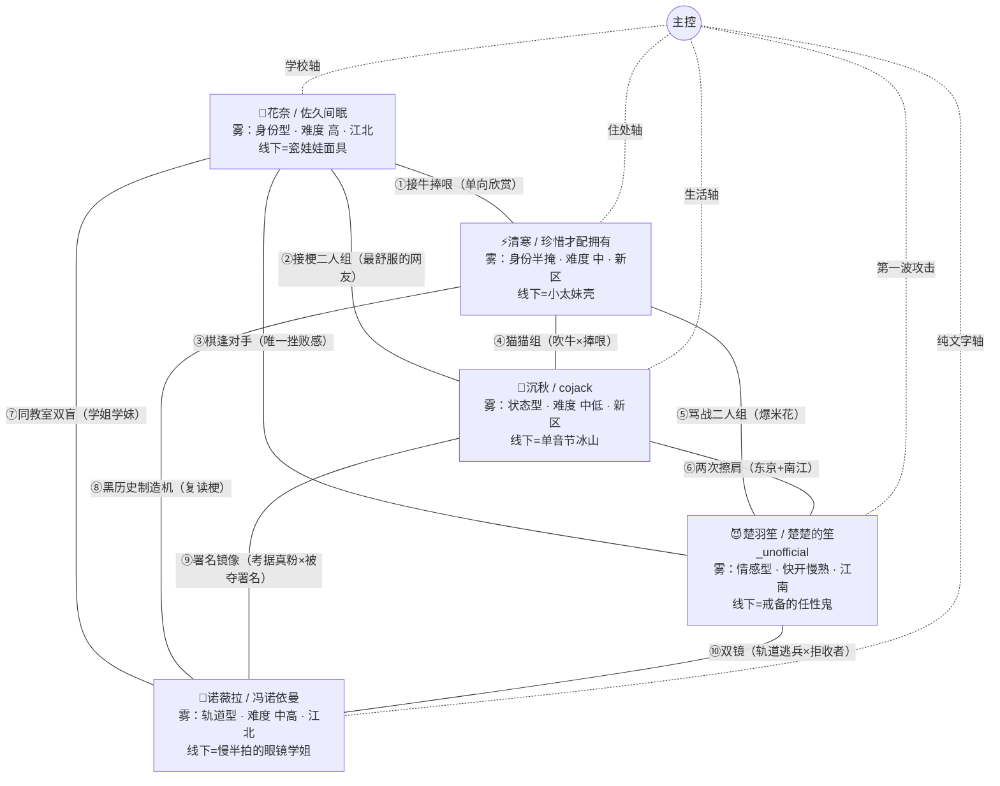

# 群像关系图 · 《在DC频道里口嗨的群友就住我隔壁？！》

> 版本：v1.0（2026-08-29）｜ 五人全员 + 主控节点，10 对关系全量
> 楚羽笙提案已全部转正（DEC-021）；诺薇拉已锁定（DEC-020）
> 用途：起源层（ENT-001）+ 角色层词条（P1-P5）+ 迷雾事实注册表的蓝本

## 总览

**地理**：花奈、诺薇拉守江北（同区两级：老公房×花园洋房），清寒、沉秋共居新区，楚羽笙独占江南——三区五人，所有线下相遇都要跨江。

## 十对关系

### ① 花奈 × 清寒 ——「文豪与牛皮」
短暂但单向欣赏：清寒吹牛，花奈是唯一不拆穿还帮着吹圆的人；清寒记住"文采好"，花奈对她只有"爱吹牛的"印象——不对称。线下零交集（反向设计，永不相遇）。引信：花奈揭晓日，清寒发现自己吹的每头牛都有文豪在场。

### ② 花奈 × 沉秋 ——「两个只有线上才能说话的人」
接梗最顺二人组（猫meme×文学自嘲）。沉秋发过露脸照——花奈其实"见过"猫猫头的脸，不知该往哪对号；沉秋不知佐久间眠在同一座城。地理精确反错开（花奈绕开的江南正是沉秋游荡处）。引信：线下相认=冰山对瓷娃娃，两个"线下静音人"面面相觑。

### ③ 花奈 × 楚羽笙 ——「面具大师 × 节奏大师」
棋逢对手：楚羽笙全群唯一挫败感来源，私下"这人难搞"，却最喜欢找她聊。全图唯一"单向深度认知"边——花奈的树洞视角早已注意到楚楚的笙的异常。地理镜像：一个住童年豪宅的隔壁，一个住官方剧本的隔壁。引信：花奈很可能是第一个看穿"坏女人表演"的人——但她不会说。

### ④ 清寒 × 沉秋 ——「猫猫组」
头像组+相声搭档（吹牛×捧哏）。双向高估：都以为对方是更成熟的社会人，实际一个是高中生、一个是家里蹲。同住新区但动线错开。引信：双重揭晓=双重幻灭→双重温暖，全群最容易互相原谅的一对。"猫猫头又鸽了"骂得最凶的是清寒——她不知道鸽子僵在了家门口。

### ⑤ 清寒 × 楚羽笙 ——「骂战二人组」
全群的爆米花，互喷是友情的语法。认知差：楚羽笙不知"杂鱼"骂的是 18 岁高中生；清寒不知对方是东大金融富家女——都以为在跟同类吵架。深层：两个家庭缺位的女儿，骂战从不碰家事（默契的雷区互避即亲密）。引信：揭晓连环爆+线下初见先吵后好——最吵也最铁。

### ⑥ 沉秋 × 楚羽笙 ——「两次擦肩的人」
梗库×接梗王的平局（respectful）。楚羽笙以为对猫猫头了如指掌，唯独不知"一线设计师"是假的。双向盲擦肩×2：东京 2022-2023（早稻田×东大）+南江商圈；另有 livehouse 一次疑似照面（未敢认）。引信：楚羽笙最可能"无意说中"沉秋痛处→把人聊没了→她的道歉方式=攻略线第一次真心时刻。

### ⑦ 花奈 × 诺薇拉 ——「同教室的双盲」（全群最强线下擦肩）
南江大学中文系延毕学姐（2025-2026 重修年）×文学系大一学妹（2026 入学）——**同一间公共教室，一年，互不知情**。一个不社交的眼镜学姐，一个不提学校的学妹；线下同区两级（花园洋房×老公房），图书馆「叠书」共用过。线上：考据党×文学自嘲的潜在文字对手。引信："大学里最摸鱼的课"话题让两人各自讲出同一间教室的同一段往事——对上号的瞬间，全群最安静的一次爆点。

### ⑧ 清寒 × 诺薇拉 ——「黑历史制造机」
清寒的牛皮被原句复读、钉上句号、变成群梗；"你先把话说完。"是吹牛的降维打击。清寒对她最恨又最离不开（骂战需要观众，复读就是最高级的观众反应）。互盲：诺薇拉不知"社会大姐"是高中生，清寒不知复读是对方参与对话的方式。引信：清寒某天发现"最恨的人"是南江大学学姐——届时的表情管理必然失败。

### ⑨ 沉秋 × 诺薇拉 ——「署名镜像」
一个被夺走署名（作品火过，名字不是她的），一个拒绝署名（写得好，从不发布）。诺薇拉作为考据党**收藏并研究过沉秋在业时期的公开作品，是真粉**——单盲；沉秋完全不知情。引信：诺薇拉某天在群里提起"我考据过一个设计师的作品"→沉秋认出那是自己→"发布吧，署名很重要"与"我以为没人在意"的双向治愈，全群最温柔的一场戏。

### ⑩ 楚羽笙 × 诺薇拉 ——「双镜」
轨道**逃**兵（东大金融，跑到东京又回来）×轨道**拒**收者（区委子女，从没离开南江）；一个吵到极致一个静到极致。楚羽笙的连发攻击在复读面前全部失效——全群第二个平局。以为对方只是懒散宅女，不知其延毕、才华与轨道困局；东京擦肩的记忆里没有这张脸。引信：两个"别人家孩子"互相看穿对方也在躲——吵架从不碰家事的第二对。

## 与主控的路由

| 角色 | 相遇轴 | 攻略形态 | 第一接触 |
|---|---|---|---|
| 花奈 | 学校轴（南江大学） | 高难度三门，跳步即静默退出 | 眼熟→对网名 |
| 清寒 | 住处轴（新区夜市/小卖部） | 中难度，难在"不把她当小孩" | 被吹牛吓唬 |
| 沉秋 | 生活轴（便利店/驿站/游荡） | 中低，难在"把游荡当寻找" | 全群最热情的"细说细说" |
| 楚羽笙 | 线上第一波攻击 | 快开慢熟，"被骂=接纳" | "新人！欧吉桑！" |
| 诺薇拉 | 纯文字轴 | 中高，难在"不替她规划人生" | 潜水观察→冒泡复读 |

## 五人系统对照（每格都是一对镜像）

| 系统 | 花奈 | 清寒 | 沉秋 | 楚羽笙 | 诺薇拉 |
|---|---|---|---|---|---|
| 雾型 | 身份 | 身份半掩 | 状态 | 真心 | 轨道 |
| 声音 | 最后解锁 | 公开 | 线上限定 | 武器化（快嘴） | 谜（真声=南江话） |
| 天气信号 | 越糟线上越活跃 | 越糟线上消失 | 只在线下 | 刻薄↑或骤停（双模） | 失联后静音归来 |
| 背叛响应 | 静默退出 | 翻脸堵人 | 降级不删 | 先否认后安静 | 礼貌退场（越礼貌越完） |
| 让步条件 | 有人接住她负责的事 | 有人替她挡一下 | 被看见专业 | 没被嘲笑、没被逼问 | 不被催、不替她规划 |
| 贴身旧物 | 项链（想念） | 棒球棍（安全感） | 耳坠（雄心） | 耳机盒（随手的爱） | 挂坠（嫌迷信却不摘） |

贴身旧物行=每人一件"没说出口的爱"——起源层（ENT-001）的现成骨架。

## 剧情引信 TOP 8

1. 同教室对上号（花奈×诺薇拉）："最摸鱼的课"话题——全群最安静的爆点
2. 双重揭晓（清寒×沉秋）：高中生+家里蹲连环揭穿——第一个大情感节点
3. 署名认出（沉秋×诺薇拉）："发布吧，署名很重要"——最温柔的双向治愈
4. 楚羽笙嘴快踩沉秋：把人聊没了→她的第一次真心危机
5. 花奈看穿楚羽笙：面具相认，两条最深攻略线暗线合流
6. 猫猫头赴约事件：鸽了 N 次的沉秋真的出现——群像事件
7. 揭晓连环爆（楚羽笙×清寒×花奈×诺薇拉）：四个网友的真身在同一座城市逐个显影——标题兑现时刻
8. 东京擦肩晚揭穿（沉秋×楚羽笙）：某天两人同时意识到"我们是不是在东京见过"
